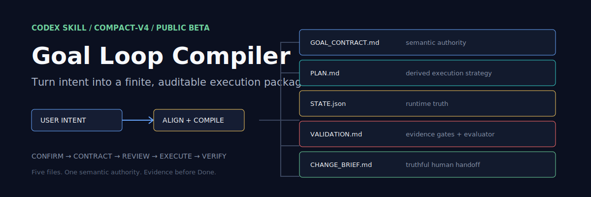

<p align="center">
  
</p>

<p align="center">
  
  
  
  
</p>

<p align="center"><strong>把模糊但有限的任务，编译成可执行、可暂停、可验证、可审计的 Codex Goal Loop 包。</strong></p>

`goal-loop-compiler` 不是另一个超长提示词，也不是后台自动化系统。它先要求用户确认 Goal Alignment Card，再把有限目标编译为五个有明确职责的文件。后续 Executor 可以据此执行、验证、暂停，并向人类如实交付结果。

> **Public beta:** `4.2.7` 的结构与 validator 已稳定，真实 Compiler 案例已通过。完整 Executor、战略证据、缺失证据 Pause 和 recurring-system 路由仍在扩大验证中。

## 为什么需要它

长任务最常见的失败不是模型不会写代码，而是目标、证据和状态互相竞争：计划重写了意图，聊天总结代替了运行状态，测试通过被误当成用户目标完成。

Goal Loop Compiler 把这些责任拆开，同时保持一个清晰的 source-of-truth map：

| 文件 | 唯一职责 |
| --- | --- |
| `GOAL_CONTRACT.md` | Goal、真实意图、成功标准、范围、非目标和暂停条件 |
| `PLAN.md` | 从契约派生的执行策略，不重写 Intent |
| `STATE.json` | 当前状态、开放差距、证据、预算和下一焦点 |
| `VALIDATION.md` | compile/completion 门禁与最终 evaluator 规则 |
| `CHANGE_BRIEF.md` | 给人看的最终交付层，初始必须是 `pending` |

```text
request
  ↓
Goal Alignment Card ── human confirm
  ↓
five-file package ── compile validation
  ↓
separate Executor ── create_goal → evidence → review
  ↓
Done | Continue | Pause
```

## 核心边界

- **Compiler 与 Executor 分离。** Compiler 只创建五文件包、运行 compile validation、报告路径，然后停止。
- **证据先于 Done。** `Done` 必须关闭 gaps、blockers、next focus 和 pause reasons，并有独立 pre-Done review。
- **状态只有一个权威来源。** 聊天总结、Launch Prompt 和 Change Brief 都不能替代 `STATE.json`。
- **Recurring system 不伪装成 finite goal。** 每日任务、监控和后台循环只输出 handoff/proposal，不创建有限目标包。
- **不靠文件膨胀解决问题。** 默认包始终只有五个文件；continuation summary 只能在包外按需导出。

## 安装

### 让 Codex 安装

在 Codex 中发送：

```text
Install the goal-loop-compiler skill from:
https://github.com/fxbillu/goal-loop-compiler/tree/main/skills/goal-loop-compiler
```

### 手动安装

```bash
git clone https://github.com/fxbillu/goal-loop-compiler.git
mkdir -p ~/.codex/skills
cp -R goal-loop-compiler/skills/goal-loop-compiler ~/.codex/skills/
```

安装或更新后重启 Codex，让新的 Skill 定义进入新任务上下文。

## 第一次使用

显式调用 Skill，并给出一个有终点、值得分阶段验证的任务：

```text
Use $goal-loop-compiler to compile, but not execute, a finite delivery package.
The final deliverables are reviewed_applications.csv and eligibility_report.md.
First output the Goal Alignment Card and wait for my literal confirm.
```

确认卡片前，Skill 不应创建文件或运行命令。发送 `confirm` 后，它会创建：

```text
.goal/goals/<YYYY-MM-DD-task-slug>/
├── GOAL_CONTRACT.md
├── PLAN.md
├── STATE.json
├── VALIDATION.md
└── CHANGE_BRIEF.md
```

Compiler 完成后，使用一个独立任务启动 Executor，并要求它真实调用 `create_goal`。这种分离让“契约是否正确”和“执行是否完成”拥有不同证据。

## Validator

Validator 只使用 Python 标准库：

```bash
python3 skills/goal-loop-compiler/scripts/validate_package.py \
  --phase compile .goal/goals/<goal-slug>

python3 skills/goal-loop-compiler/scripts/validate_package.py \
  --phase review-digest .goal/goals/<goal-slug>

python3 skills/goal-loop-compiler/scripts/validate_package.py \
  --phase completion .goal/goals/<goal-slug>
```

它会拦截缺文件、重复 source of truth、PLAN 重写 Intent、伪造完成、Done 残留 blocker、Change Brief 无证据声明和审查摘要漂移。Reviewer 的真实 provenance 仍必须从 Codex rollout 独立核验，静态 validator 不伪装成身份认证系统。

## 本地验证

```bash
python3 -m unittest discover -s tests -p 'test_*.py'
PYTHONPYCACHEPREFIX=/tmp/goal-loop-compiler-pycache \
  python3 -m py_compile \
  skills/goal-loop-compiler/scripts/validate_package.py \
  tests/test_validate_package.py
```

当前仓库包含 57 个 validator 回归测试，覆盖 compile、review digest、completion、状态预算和关键故障注入。

## 项目状态

| 能力 | 状态 |
| --- | --- |
| 五文件 compact-v4 结构 | 已验证 |
| compile / review-digest / completion validator | 已验证 |
| 可见任务中的 Alignment Card 与人工确认闸门 | 已验证 |
| 可见 Compiler 五文件编译 | 已验证 |
| 独立 Executor 完整 Done | 扩大验证中 |
| Strategic Evidence Gate | 扩大验证中 |
| 缺失科学证据时正确 Pause | 扩大验证中 |
| Recurring system 拒绝 finite package | 扩大验证中 |

### 已知限制

- 某些 Codex Goal Mode 运行时会在等待人工 `confirm` 时自动 continuation；连续等待可能暂时显示 `blocked`。用户发送 literal `confirm` 后可以恢复。该行为正在作为公开 beta 的重点兼容性问题验证。
- Validator 可以验证审查记录结构和 artifact digest，但 reviewer 身份真实性必须结合 rollout 证据检查。
- 旧三文件 Goal 包不会自动迁移。

## 设计原则

1. 用户意图完成度高于流程仪式。
2. 单一语义源、单一状态源、单一验证源。
3. 每个新增字段和门禁都必须防止真实失败。
4. 不把 recurring automation 塞进有限 Goal。
5. 表达可以压缩，边界和证据不能被压缩掉。

## 致谢

- [GoalPro](https://github.com/KimYx0207/GoalPro) 提供了高质量 Goal/Loop 语义契约的重要启发；本项目进一步把这些语义编译为文件化 runtime authority。
- README 的信息层级与项目原生 SVG 方法参考了 [beautify-github-readme](https://github.com/oil-oil/beautify-github-readme)。

## License

[MIT](./LICENSE) © 2026 fxbillu
